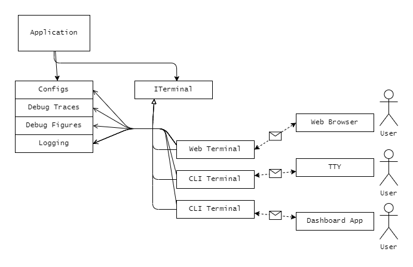

# C++17 PERFORMANCE BENCHMARK & CONFIGURATION KIT

Add control point on your application.

# Dependencies

Using this library will introduce tons of new dependencies to your application. 🤣

> Hopefully some are private dependency, which may not add dependencies on your build directly.

### Core

- [gabime/spdlog](https://github.com/gabime/spdlog.git)
- [fmtlib/fmt](https://github.com/fmtlib/fmt)
- [kang-sw/cppheaders](https://github.com/kang-sw/cppheaders)
- [nlohmann/json](https://github.com/nlohmann/json)
- [ericniebler/range-v3](https://github.com/ericniebler/range-v3)

### Net

- [asio](https://think-async.com/Asio/)
- [okdshin/PicoSHA2](https://github.com/okdshin/PicoSHA2)

### Web

- [CrowCpp/Crow](https://github.com/CrowCpp/Crow)
- [asio](https://think-async.com/Asio/)

### Extra

- [taywee/args](https://github.com/Taywee/args)

# Quickstart

This library does not provide any installation script. Simply clone this repository recursively, and add it as subdirectory of your CMakeLists.txt script.

# Concepts

You can instanciate [config classes](#config-class), [tracers](#debug-tracers), [loggers](#loggers) on your application, and register them to global registry instance on demand. You can also create [terminals](#terminals) in application scope. Terminals has access to all the contexts that you have instantiated, and provides user a way to control over your application contexts remotely/locally.

[Web Terminal Example](doc/web-term-example.jpeg)

Above link is an example of terminal implementations. Web terminal is bundled with tiny single-page-application to access local contexts over web protocols.

## Config Class

## Debug Tracers

## Loggers

# Terminals

## Security

Currently, there is no concept of security or authentications on this library. This is basically I use this library to create internal applications that don't expose any access point to public. As this library may expose some critical part of applications through 'terminal', you'd be very careful when applying this library for any exposed software.

